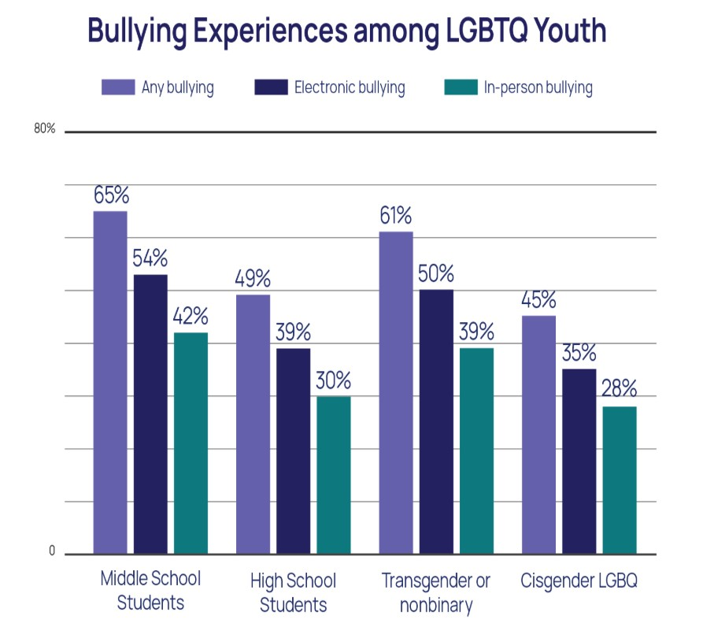
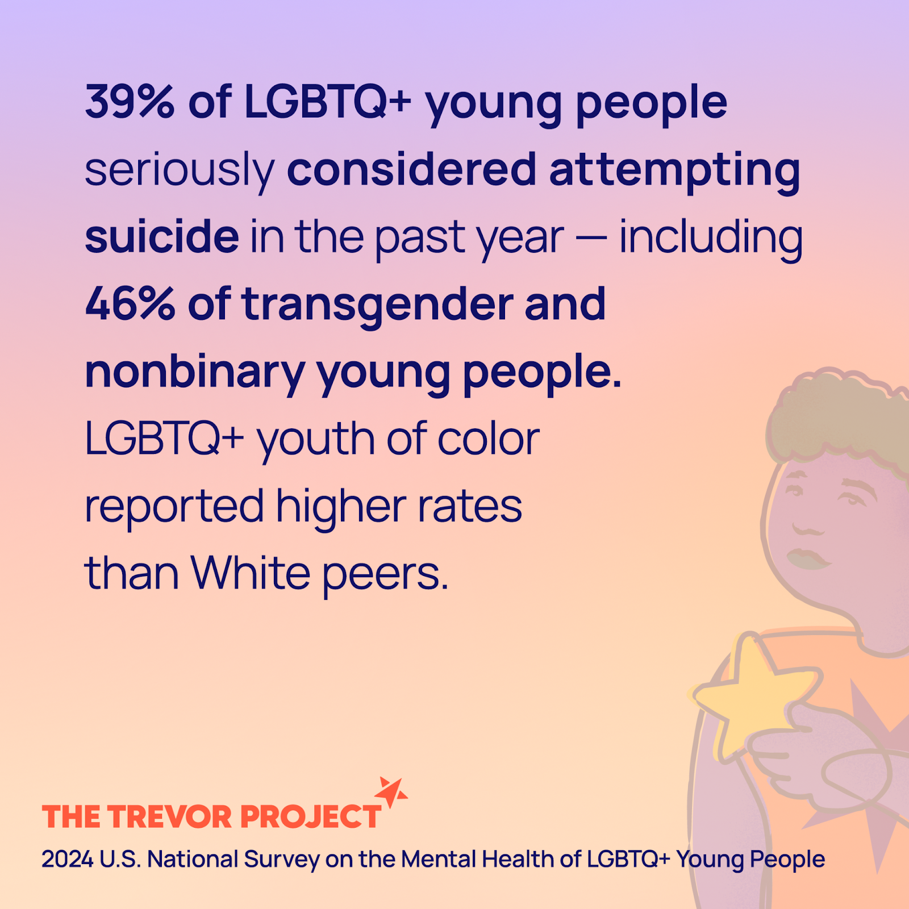

<head>
	<link rel="stylesheet" href="/assets/css/main.css"/>
</head>

## Introduction
“Can you imagine you’re a parent and your son leaves the house and you say, ‘Jimmy, I love you so much, go have a good day in school,’ and your son comes back with a brutal operation?" That is a direct quote from Donald Trump during a rally in Wisconsin during the 2024 presidential elections, but is it true, what are schools teaching children about gender and sexuality? 
	
 Organization such as <a href="https://www.glsen.org/" target="_blank">GLSEN</a> (Gay, Lesbian & Straight Education Network) provide age appropriate lessons for each age. Early elementary lessons focus on exploring inclusionary and exclusionary language, different family structures, and harmful gender stereotypes. Teachers are never giving sex ed lessons but often will read books in the classroom that contain characters with two of the same sex parent or explain gender identity on a basic level. There is no record of any school or individual educator with an idea such as teaching children about gender reassignment surgeries, let alone preforming them. The common factor in all these lessons is acceptance and that it is okay to be yourself, even if that means Jimmy wants to wear pink instead of blue. 
Many believe that there is no point in educating students at any age about sexuality and gender. They may ask why five year old Jimmy need to know that gay people exist or transgender individuals, but what happens when he finds out they exist or that he is different than everyone else around him? 	How easy is it for someone to change their entire mindset, let alone a child. How will his mental health be impacted if he finds out he is different than everyone else and can't put words to it?

## Why is it important? 
Many individuals are against or neutral to the fight for queer rights simply because they do not understand it. Children develop a sense of roles and societal expectations starting at age two, meaning that it is incredibly hard for people to grasp the idea of a gender spectrum or someone having two moms when those stereotypes and roles are what they've been shown and taught their entire lives. The earlier children are introduced to these topics, the easier it is for them to understand and accept, leading to a generation of inclusive adults. 
Despite what many may think, it is really easy to explain to a child that some people have two dads, or some boys like dresses and that's okay. Young children are endlessly curious about the world around them, and the queer community is apart of that world. This simple lesson requires no introduction to sex or gender, but simply that everyone is different and love comes in many forms. The result of these simple lessons is a world where everyone is allowed to be themselves without pushbacks or risks.
Providing students with the proper information, definitions, and labels aid students who may not understand why they are different than their peers or the feelings they are experiencing. The education does not "indoctrinate" into being queer, but simply give those the words to express themselves that they did not have before. 

## What happens without it?

### Inclusivity & Acceptance
Acceptance from family, friends, and peers is important to everybody, but members of the queer community fight for it everyday due to ignorance or lack of understanding from others. Unfortunately the reality many members of the queer community face is having to go through the world day to day afraid of what people passing by are thinking, what if someone says or does something, and who is safe to talk to. 

	
	

		<a href="https://www.thetrevorproject.org/research-briefs/bullying-and-suicide-risk-among-lgbtq-youth/" target="_blank">Source: The Trevor Project</a>
	

Safety: 
	Without the proper education and awareness, the world is led to give into dangerous and untrue stereotypes about the queer community. Claims such as transwomen are just trying to harass people in the bathroom are reasons why harmful legislation is currently being passed to strip the queer community of their rights to just exist. The lack of education in the U.S leads to harassment, hate crimes, and discrimination to millions of Americans each and every day.

	
	

		<a href="https://www.thetrevorproject.org/survey-2024/#key-finding-1/" target="_blank">Source: The Trevor Project</a>
	

### Mental Health
Many states do no incorporate any form of queer education within the classrooms. Not only does this lead the queer youth to be confused and unaware of if what they are experiencing is okay, but leaves room for bully by those who do not accept something that goes against the societal roles and expectations they've grown up with. Due to the bullying and exclusion from their community, queer youth's mental health takes a drastic toll, and experience higher rates of anxiety and depression that can lead to suicidal thoughts or actions.
